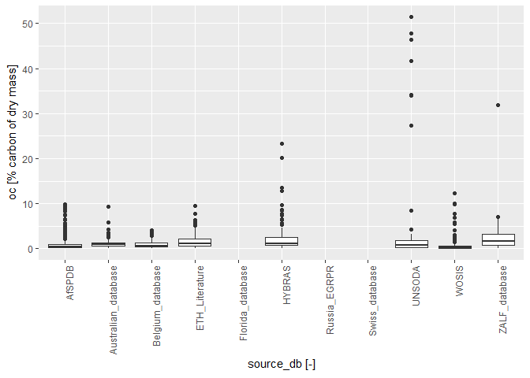
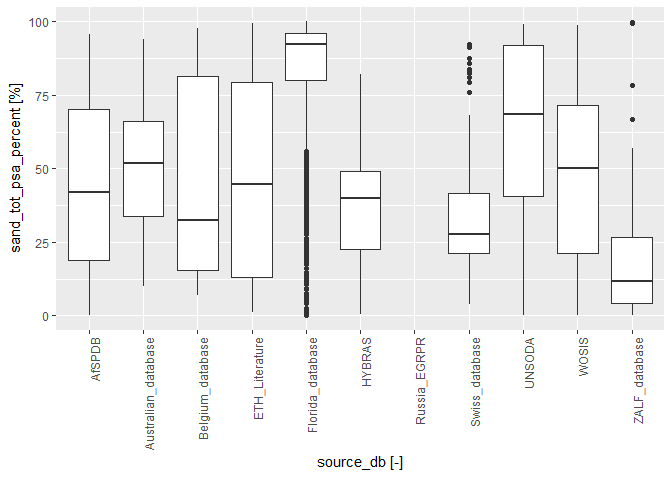
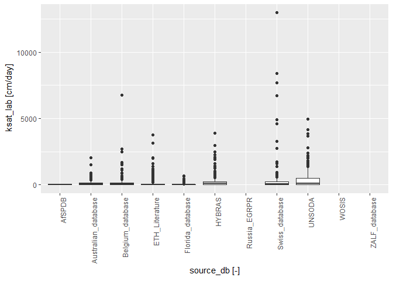
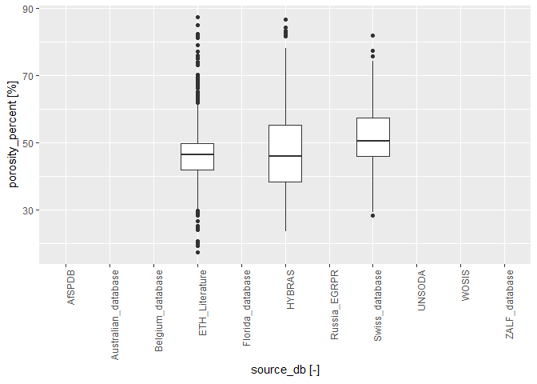
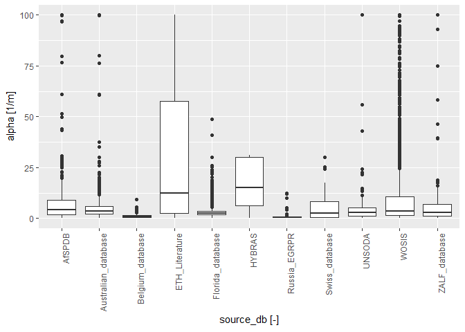
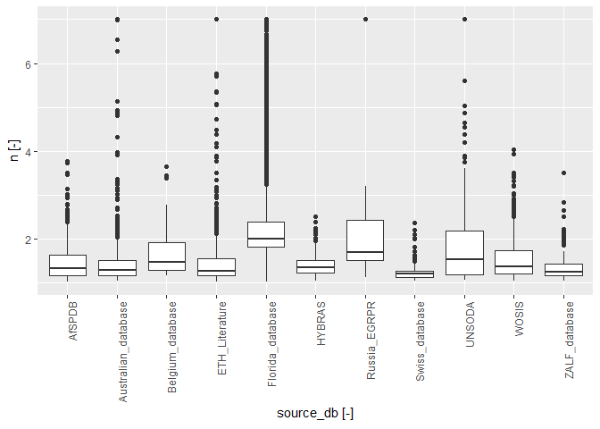
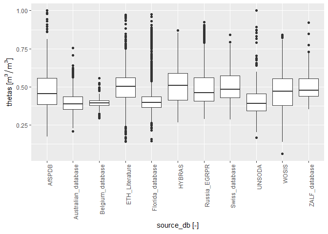
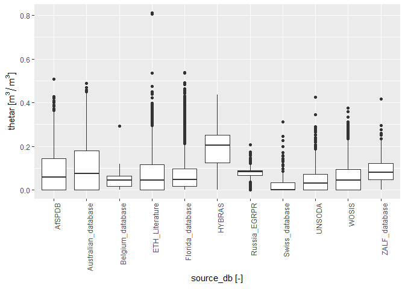

Global soil hydraulic properties (GSHP) database
================
Surya Gupta, Andreas Papritz, Peter Lehmann, Tom Hengl, Sara Bonetti,
Dani Or

  - [Bulk density (g/cm3) vs Data
    sources](#bulk-density-gcm3-vs-data-sources)
  - [Organic carbon (%) vs Data
    sources](#organic-carbon--vs-data-sources)
  - [Sand content (%) vs Data sources](#sand-content--vs-data-sources)
  - [Silt content (%) vs Data sources](#silt-content--vs-data-sources)
  - [Clay content (%) vs Data sources](#clay-content--vs-data-sources)
  - [pH vs Data sources](#ph-vs-data-sources)
  - [Field measured saturated hydraulic conductivity (cm/day) vs Data
    sources](#field-measured-saturated-hydraulic-conductivity-cmday-vs-data-sources)
  - [Lab measured saturated hydraulic conductivity (cm/day) vs Data
    sources](#lab-measured-saturated-hydraulic-conductivity-cmday-vs-data-sources)
  - [Porosity (%) vs Data sources](#porosity--vs-data-sources)
  - [VG shape parameter (1/m) vs Data
    sources](#vg-shape-parameter-1m-vs-data-sources)
  - [VG shape parameter vs Data
    sources](#vg-shape-parameter-vs-data-sources)
  - [Saturated water content (m3/m3) vs Data
    sources](#saturated-water-content-m3m3-vs-data-sources)
  - [Residual water content (m3/m3) vs Data
    sources](#residual-water-content-m3m3-vs-data-sources)
  - [Root mean square error (m3/m3) vs Data
    sources](#root-mean-square-error-m3m3-vs-data-sources)

Plots of soil water characteristics data set. Total curves = 15153

``` r
library(ggplot2)

WRC<- read.csv("C:/Users/guptasu.D/Downloads/WRC_dataset_surya_et_al_2021_final.csv")

dim(WRC)
```

    ## [1] 136063     40

``` r
colnames(WRC)
```

    ##  [1] "layer_id"                  "disturbed_undisturbed"    
    ##  [3] "climate_classes"           "profile_id"               
    ##  [5] "site_key"                  "method"                   
    ##  [7] "method_keywords"           "latitude_decimal_degrees" 
    ##  [9] "longitude_decimal_degrees" "hzn_desgn"                
    ## [11] "hzn_top"                   "hzn_bot"                  
    ## [13] "db_33"                     "db_od"                    
    ## [15] "oc"                        "tex_psda"                 
    ## [17] "sand_tot_psa_percent"      "silt_tot_psa_percent"     
    ## [19] "clay_tot_psa_percent"      "ph_h2o"                   
    ## [21] "ksat_field"                "ksat_lab"                 
    ## [23] "porosity_percent"          "WG_33kpa"                 
    ## [25] "lab_head_m"                "lab_wrc"                  
    ## [27] "field_head_m"              "field_wrc"                
    ## [29] "keywords_total_porosity"   "alpha"                    
    ## [31] "n"                         "thetar"                   
    ## [33] "thetas"                    "RSS"                      
    ## [35] "RMSE"                      "SWCC_classes"             
    ## [37] "SWCC_ST_classes"           "source_db"                
    ## [39] "location_accuracy_min"     "location_accuracy_max"

``` r
unique(WRC$source_db)
```

    ##  [1] "Russia_EGRPR"        "WOSIS"               "ETH_Literature"     
    ##  [4] "Australia_DD"        "Australia_CL"        "Australia_GYC"      
    ##  [7] "AfSPDB"              "swiss_database"      "Australia_Morph"    
    ## [10] "Australia_CSIRO_LW"  "Australia_RAALS"     "Florida_database"   
    ## [13] "Australian_database" "HYBRAS"              "Australia_SSM"      
    ## [16] "UNSODA"              "Belgium_database"    "ZALF_database"

## Bulk density (g/cm3) vs Data sources

``` r
options(warn=-1)

ggplot(WRC, aes(x=source_db, y=db_od)) + geom_boxplot()+ theme(axis.text.x = element_text(angle = 90, hjust = 1))
```

<!-- -->

## Organic carbon (%) vs Data sources

``` r
ggplot(WRC, aes(x=source_db, y=oc)) + geom_boxplot()+ theme(axis.text.x = element_text(angle = 90, hjust = 1))
```

<!-- -->

## Sand content (%) vs Data sources

``` r
ggplot(WRC, aes(x=source_db, y=sand_tot_psa_percent)) + geom_boxplot()+ theme(axis.text.x = element_text(angle = 90, hjust = 1))
```

<!-- -->

## Silt content (%) vs Data sources

``` r
ggplot(WRC, aes(x=source_db, y=silt_tot_psa_percent)) + geom_boxplot()+ theme(axis.text.x = element_text(angle = 90, hjust = 1))
```

<!-- -->

## Clay content (%) vs Data sources

``` r
ggplot(WRC, aes(x=source_db, y=clay_tot_psa_percent)) + geom_boxplot()+ theme(axis.text.x = element_text(angle = 90, hjust = 1))
```

<!-- -->

## pH vs Data sources

``` r
ggplot(WRC, aes(x=source_db, y=ph_h2o)) + geom_boxplot()+ theme(axis.text.x = element_text(angle = 90, hjust = 1))
```

<!-- -->

## Field measured saturated hydraulic conductivity (cm/day) vs Data sources

``` r
ggplot(WRC, aes(x=source_db, y=ksat_field)) + geom_boxplot()+ theme(axis.text.x = element_text(angle = 90, hjust = 1))
```

<!-- -->

## Lab measured saturated hydraulic conductivity (cm/day) vs Data sources

``` r
ggplot(WRC, aes(x=source_db, y=ksat_lab)) + geom_boxplot()+ theme(axis.text.x = element_text(angle = 90, hjust = 1))
```

<!-- -->

## Porosity (%) vs Data sources

``` r
ggplot(WRC, aes(x=source_db, y=porosity_percent)) + geom_boxplot()+ theme(axis.text.x = element_text(angle = 90, hjust = 1))
```

<!-- -->

## VG shape parameter (1/m) vs Data sources

``` r
ggplot(WRC, aes(x=source_db, y=alpha)) + geom_boxplot()+ theme(axis.text.x = element_text(angle = 90, hjust = 1))
```

<!-- -->

## VG shape parameter vs Data sources

``` r
ggplot(WRC, aes(x=source_db, y=n)) + geom_boxplot()+ theme(axis.text.x = element_text(angle = 90, hjust = 1))
```

<!-- -->

## Saturated water content (m3/m3) vs Data sources

``` r
ggplot(WRC, aes(x=source_db, y=thetas)) + geom_boxplot()+ theme(axis.text.x = element_text(angle = 90, hjust = 1))
```

<!-- -->

## Residual water content (m3/m3) vs Data sources

``` r
ggplot(WRC, aes(x=source_db, y=thetar)) + geom_boxplot()+ theme(axis.text.x = element_text(angle = 90, hjust = 1))
```

<!-- -->

## Root mean square error (m3/m3) vs Data sources

``` r
ggplot(WRC, aes(x=source_db, y=RMSE)) + geom_boxplot()+ theme(axis.text.x = element_text(angle = 90, hjust = 1))
```

<!-- -->
