Global soil hydraulic properties database (GSHP): a compilation of soil
water characteristics data
================
Surya Gupta, Andreas Papritz, Peter Lehmann, Tom Hengl, Sara Bonetti,
Dani Or

  - [Bulk density vs Data sources](#bulk-density-vs-data-sources)
  - [Organic carbon vs Data sources](#organic-carbon-vs-data-sources)
  - [Sand content vs Data sources](#sand-content-vs-data-sources)
  - [Silt content vs Data sources](#silt-content-vs-data-sources)
  - [Clay content vs Data sources](#clay-content-vs-data-sources)
  - [pH vs Data sources](#ph-vs-data-sources)
  - [Field measured saturated hydraulic conductivity vs Data
    sources](#field-measured-saturated-hydraulic-conductivity-vs-data-sources)
  - [Lab measured saturated hydraulic conductivity vs Data
    sources](#lab-measured-saturated-hydraulic-conductivity-vs-data-sources)
  - [Porosity vs Data sources](#porosity-vs-data-sources)
  - [vG shape parameter vs Data
    sources](#vg-shape-parameter-vs-data-sources)
  - [vG shape parameter vs Data
    sources](#vg-shape-parameter-vs-data-sources-1)
  - [Saturated water content vs Data
    sources](#saturated-water-content-vs-data-sources)
  - [Residual water content vs Data
    sources](#residual-water-content-vs-data-sources)

Plots of soil water characteristics data set. Total curves = 15259

``` r
library(ggplot2)

WRC<- read.csv("C:/Users/guptasu.D/Documents/GSHP manuscript/WRC_dataset_surya_et_al_2021_final.csv")

dim(WRC)
```

    ## [1] 136989     53

``` r
colnames(WRC)
```

    ##  [1] "layer_id"                  "disturbed_undisturbed"    
    ##  [3] "climate_classes"           "profile_id"               
    ##  [5] "reference"                 "method"                   
    ##  [7] "method_keywords"           "latitude_decimal_degrees" 
    ##  [9] "longitude_decimal_degrees" "hzn_desgn"                
    ## [11] "hzn_top"                   "hzn_bot"                  
    ## [13] "db_33"                     "db_od"                    
    ## [15] "oc"                        "tex_psda"                 
    ## [17] "sand_tot_psa"              "silt_tot_psa"             
    ## [19] "clay_tot_psa"              "ph_h2o"                   
    ## [21] "ksat_field"                "ksat_lab"                 
    ## [23] "porosity"                  "WG_33kpa"                 
    ## [25] "lab_head_m"                "lab_wrc"                  
    ## [27] "field_head_m"              "field_wrc"                
    ## [29] "keywords_total_porosity"   "SWCC_classes"             
    ## [31] "source_db"                 "location_accuracy_min"    
    ## [33] "location_accuracy_max"     "broad_accuracy_classes"   
    ## [35] "alpha"                     "se_alpha"                 
    ## [37] "n"                         "se_n"                     
    ## [39] "thetar"                    "thetas"                   
    ## [41] "q2.5_alpha"                "q97.5_alpha"              
    ## [43] "q2.5_n"                    "q97.5_n"                  
    ## [45] "q10_alpha"                 "q90_alpha"                
    ## [47] "q10_n"                     "q90_n"                    
    ## [49] "q25_alpha"                 "q75_alpha"                
    ## [51] "q25_n"                     "q75_n"                    
    ## [53] "data_flag"

``` r
unique(WRC$source_db)
```

    ##  [1] "AfSPDB"              "Australian_database" "Belgium_database"   
    ##  [4] "ETH_Literature"      "Florida_database"    "HYBRAS"             
    ##  [7] "Russia_EGRPR"        "Swiss_database"      "UNSODA"             
    ## [10] "WOSIS"               "ZALF_database"

## Bulk density vs Data sources

``` r
options(warn=-1)

ggplot(WRC, aes(x=source_db, y=db_od)) + geom_boxplot()+ theme(axis.text.x = element_text(angle = 90, hjust = 1))+labs( y= expression(paste("db_od [", g/cm^{3},"]")), x = expression(paste("source_db [-]" )))
```

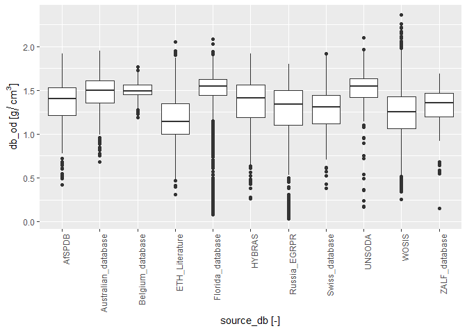<!-- -->

## Organic carbon vs Data sources

``` r
ggplot(WRC, aes(x=source_db, y=oc)) + geom_boxplot()+ theme(axis.text.x = element_text(angle = 90, hjust = 1))+labs( y= expression(paste("oc [% carbon of dry mass]")), x = expression(paste("source_db [-]" )))
```

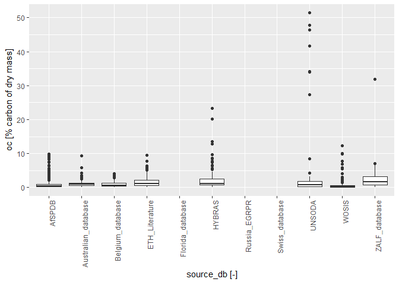<!-- -->

## Sand content vs Data sources

``` r
ggplot(WRC, aes(x=source_db, y=sand_tot_psa)) + geom_boxplot()+ theme(axis.text.x = element_text(angle = 90, hjust = 1))+labs( y= expression(paste("sand_tot_psa [dekagram/kg]")), x = expression(paste("source_db [-]" )))
```

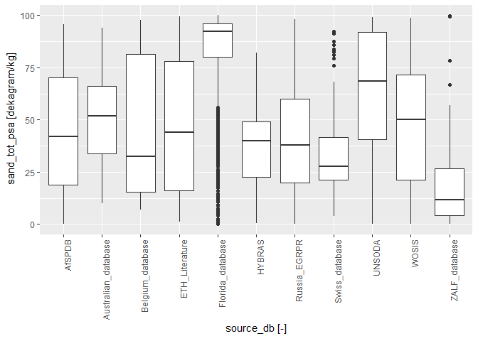<!-- -->

## Silt content vs Data sources

``` r
ggplot(WRC, aes(x=source_db, y=silt_tot_psa)) + geom_boxplot()+ theme(axis.text.x = element_text(angle = 90, hjust = 1))+labs( y= expression(paste("silt_tot_psa [dekagram/kg]")), x = expression(paste("source_db [-]" )))
```

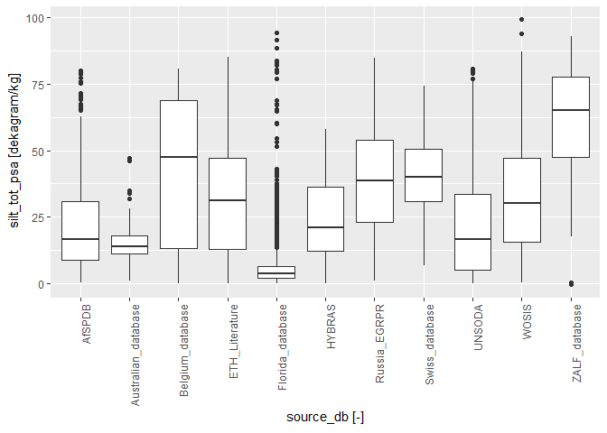<!-- -->

## Clay content vs Data sources

``` r
ggplot(WRC, aes(x=source_db, y=clay_tot_psa)) + geom_boxplot()+ theme(axis.text.x = element_text(angle = 90, hjust = 1))+labs( y= expression(paste("clay_tot_psa [dekagram/kg]")), x = expression(paste("source_db [-]" )))
```

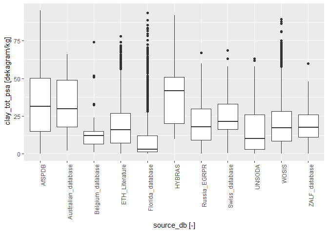<!-- -->

## pH vs Data sources

``` r
ggplot(WRC, aes(x=source_db, y=ph_h2o)) + geom_boxplot()+ theme(axis.text.x = element_text(angle = 90, hjust = 1))+labs( y= expression(paste("ph_h2o [-]")), x = expression(paste("source_db [-]" )))
```

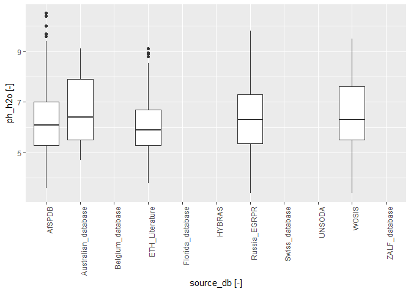<!-- -->

## Field measured saturated hydraulic conductivity vs Data sources

``` r
ggplot(WRC, aes(x=source_db, y=ksat_field)) + geom_boxplot()+ theme(axis.text.x = element_text(angle = 90, hjust = 1))+labs( y= expression(paste("ksat_field [cm/day]")), x = expression(paste("source_db [-]" )))
```

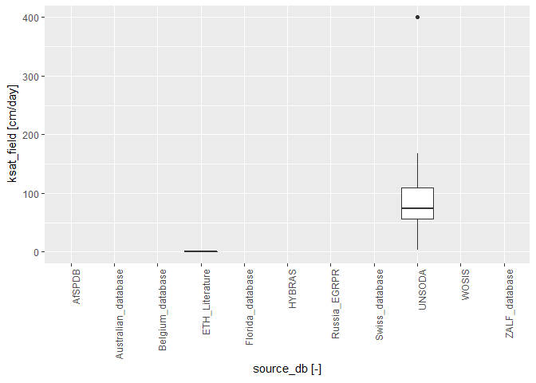<!-- -->

## Lab measured saturated hydraulic conductivity vs Data sources

``` r
ggplot(WRC, aes(x=source_db, y=ksat_lab)) + geom_boxplot()+ theme(axis.text.x = element_text(angle = 90, hjust = 1))+labs( y= expression(paste("ksat_lab [cm/day]")), x = expression(paste("source_db [-]" )))
```

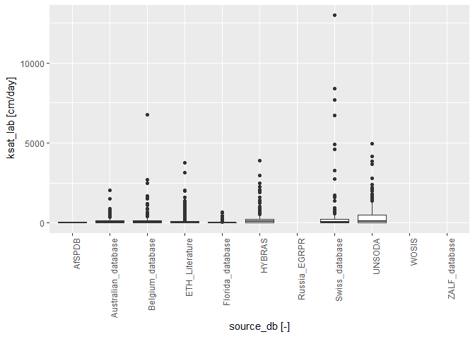<!-- -->

## Porosity vs Data sources

``` r
ggplot(WRC, aes(x=source_db, y=porosity)) + geom_boxplot()+ theme(axis.text.x = element_text(angle = 90, hjust = 1))+labs( y= expression(paste("porosity [", m^{3}/m^{3},"]")), x = expression(paste("source_db [-]" )))
```

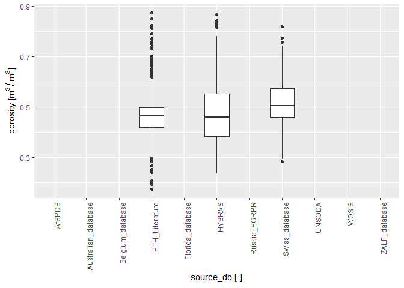<!-- -->

## vG shape parameter vs Data sources

``` r
ggplot(WRC, aes(x=source_db, y=alpha)) + geom_boxplot()+ theme(axis.text.x = element_text(angle = 90, hjust = 1))+labs( y= expression(paste("alpha [1/m]")), x = expression(paste("source_db [-]" )))
```

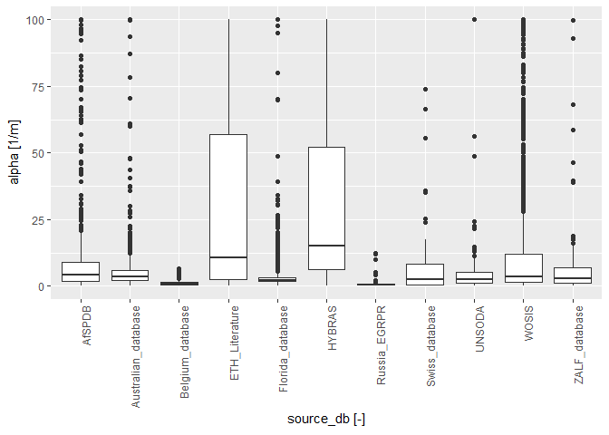<!-- -->

## vG shape parameter vs Data sources

``` r
ggplot(WRC, aes(x=source_db, y=n)) + geom_boxplot()+ theme(axis.text.x = element_text(angle = 90, hjust = 1))+labs( y= expression(paste("n [-]")), x = expression(paste("source_db [-]" )))
```

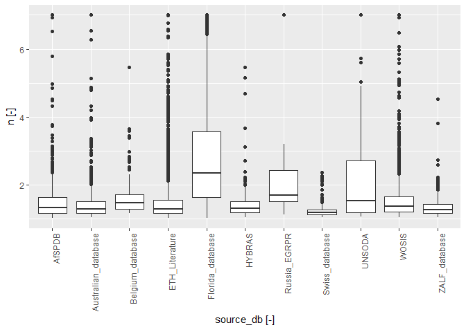<!-- -->

## Saturated water content vs Data sources

``` r
ggplot(WRC, aes(x=source_db, y=thetas)) + geom_boxplot()+ theme(axis.text.x = element_text(angle = 90, hjust = 1))+labs( y= expression(paste("thetas [", m^{3}/m^{3},"]")), x = expression(paste("source_db [-]" )))
```

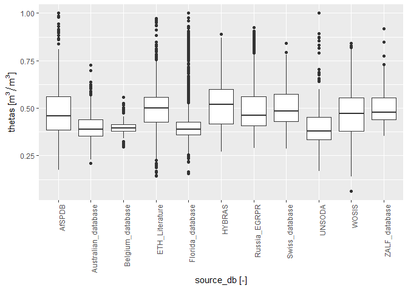<!-- -->

## Residual water content vs Data sources

``` r
ggplot(WRC, aes(x=source_db, y=thetar)) + geom_boxplot()+ theme(axis.text.x = element_text(angle = 90, hjust = 1))+labs( y= expression(paste("thetar [", m^{3}/m^{3},"]")), x = expression(paste("source_db [-]" )))
```

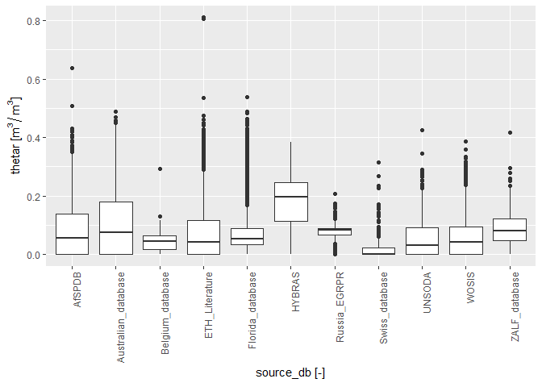<!-- -->
